## Git 安装与配置

### 下载

* https://git-scm.com/download/

### 使用

* **win**：右键菜单 → git bash
* **mac**：终端窗口

### 基础配置

1. 首次使用添加身份说明，使用以下两个命令：

   ```shell
   $ git config --global user.name "你的呢称"
   $ git config --global user.email "邮箱@example.com"
   ```

2. 创建仓库

   a) 在项目文件夹下使用==git bash==输入 `$git init`

   b) 使用他人项目创建仓库 `$git clone项目url`

## 状态与版本提交

### 文件状态跟踪

1. 跟踪文件：`$git add <name>`
2. 跟踪整个目录：`$git add .`
3. 取消跟踪：`$git rm <name>`

4. 保留在目录里但不跟踪：`$git rm-cache <name>`

### 文件状态修改

1. 将修改文件缓存：`git add <file-name>`
2. 取消缓存：`git reset HEAD <name>`
3. 提交缓存修改：`git commit`

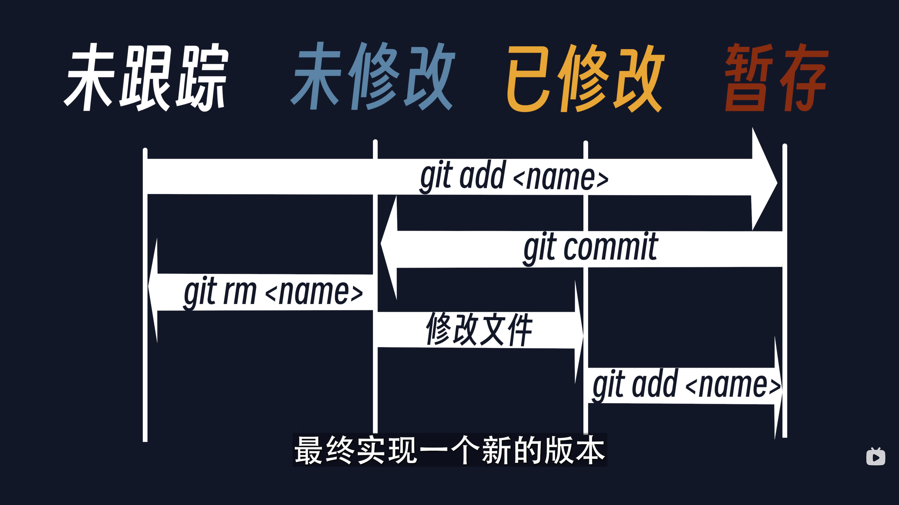

**一个文件的四个状态**

4. git commit具体操作

* **方法一**：git commit进入提交界面，按==ⅰ键==进入输入模式后输入你对提交内容的描述，然后==esc==退出编辑模式，按`:wq`保存并退出。
* **方法二**：`git commit -m ‘你对提交内容的描述’`
* **方法三**：`git commit -a` 连带未暂存文件一起提交 `git commit -am ‘提交描述‘`用了git commit -a 所以不用先 git add 了。
* **方法四**：`git reset head~ --soft` 【注意】使用该命令取消本次提交，但是首次提交不可撤回。

### 查看文件状态

1. `git status`

   ==红色==代表已修改，未暂存；==绿色==代表已暂存；提交后，则不显示

   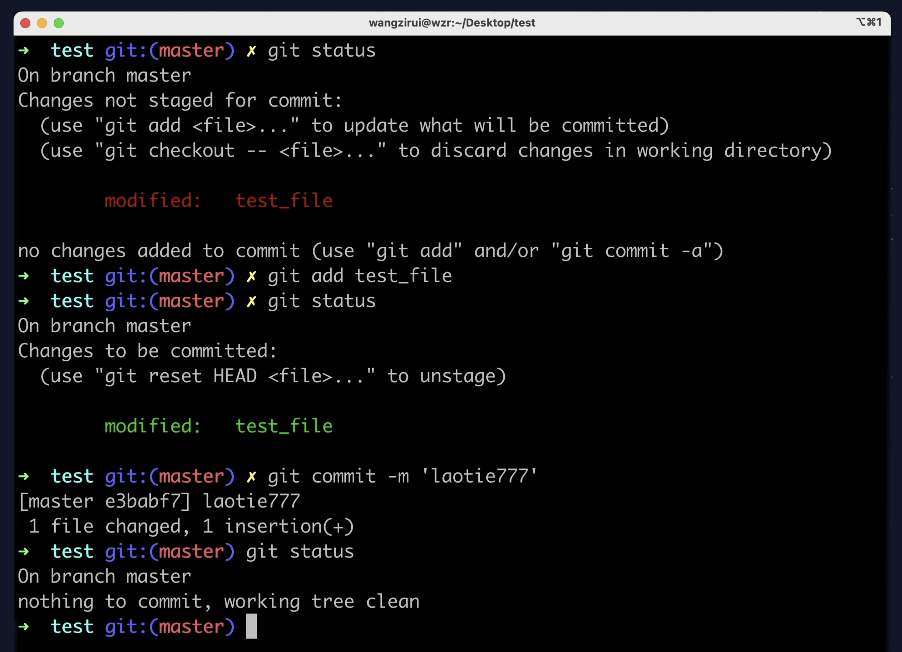

​	

2. `git diff`：详细查看文件的第几行第几个字母被修改了。
3. `git log`：查看提交历史信息。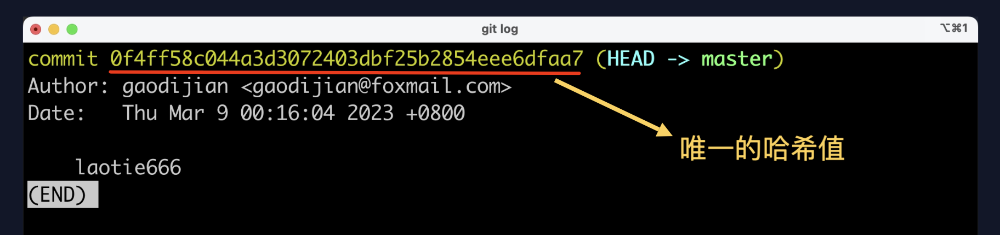

4. `git log --all`：查看所有分支的提交，结合graph食用更佳

## 远程仓库

### 新建仓库

```zsh
echo "# test" >> README.md
git init	#仓库初始化
git add README.md		#暂存一个文件
git commit -m "first commit"	#提交暂存文件
git branch -M main  #创建一个 main 分支并把它改为主分支
git remote add origin https://github.com/edsml-0ab964b7/test.git
git push -u origin main
```

### 链接远程仓库

* `git remote add origin 远程仓库链接`

  * **origin**：仓库名字

  * **远程仓库链接**：https 开头的链接

* `git remote`：检查是否已经添加成功

### 仓库重命名

* `git remote rename 目标仓库名 新名字`

### 推送代码

* `git push 仓库名 分支名`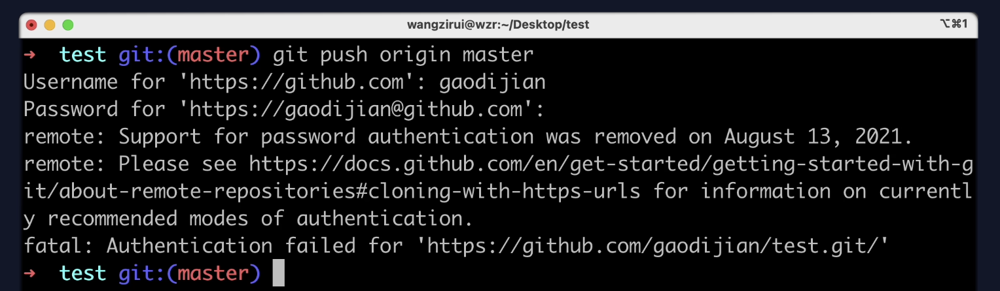

​	==❌错误==：GitHub已禁止使用用户名与密码验证

**解决方法一：**使用 Token

1. 使用token令牌验证

   <kbd>Settings</kbd> -> <kbd>Developer settings</kbd> -> <kbd>Personal access tokens</kbd> -> <kbd>Tokens (classic)</kbd>-> <kbd>Generate new token</kbd> -> <kbd>Generate new token (classic)</kbd>  -> <kbd>填写令牌名称</kbd>-> <kbd>打开仓库有关权限</kbd>> <kbd>生成令牌</kbd>

2. 再次 push，密码使用刚才复制的 Token。

**解决方法二：**使用 ssh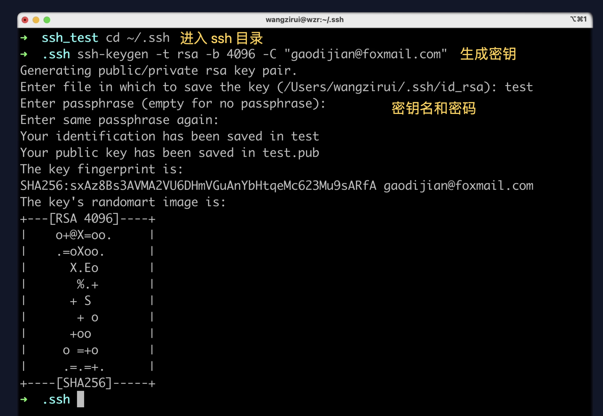

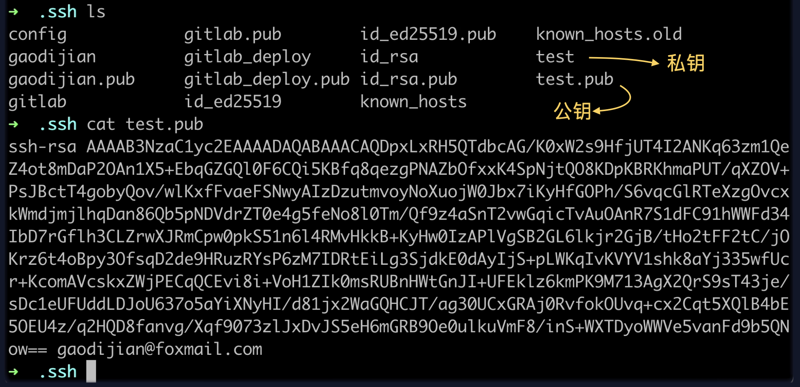

<kbd>复制公钥</kbd> -> <kbd>Settings</kbd> -> <kbd>SSH and GPG keys</kbd> -> <kbd>New SSH key</kbd>-> <kbd>Generate new token</kbd> -> 

<kbd>粘贴密钥</kbd>  -> <kbd>返回仓库在克隆按钮中复制其 ssh 链接</kbd>-> <kbd>打开电脑终端</kbd>> <kbd>git clone 链接</kbd>

## 分支 branch

分支就是把当前版本**复制**了一份。

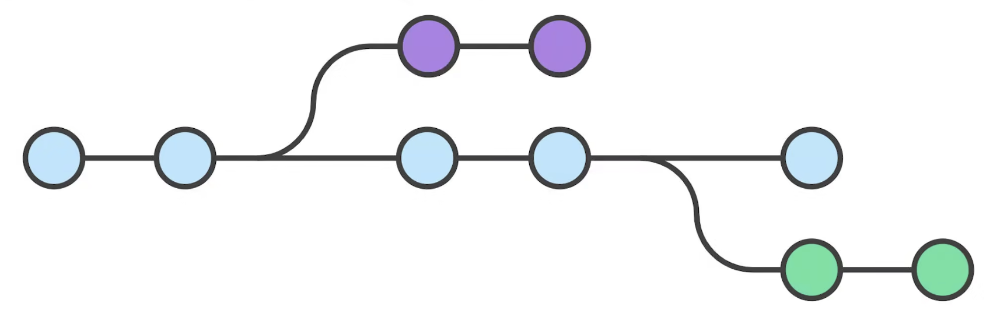

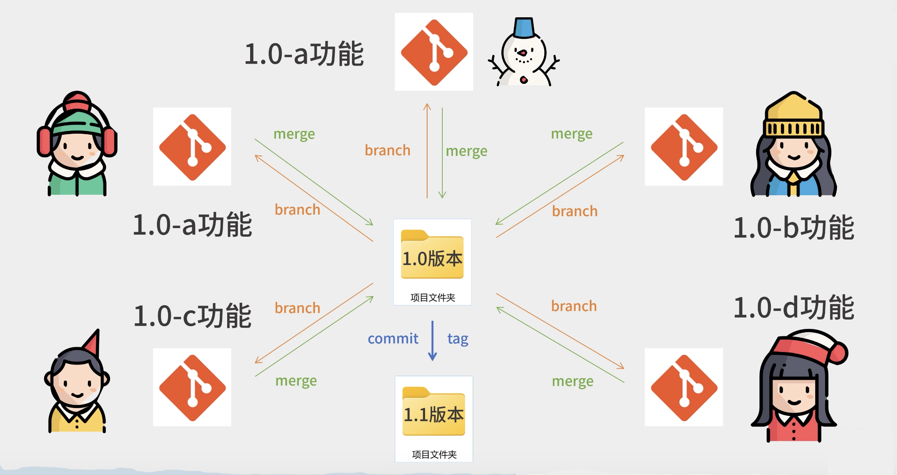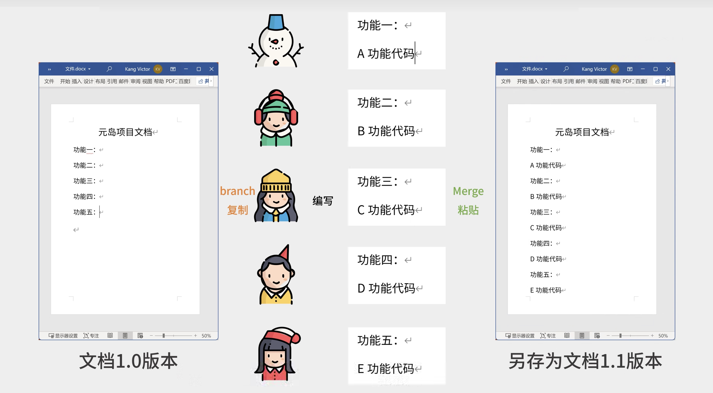

### 新建分支

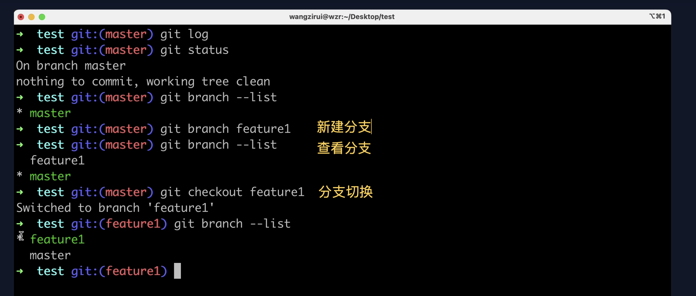

⚠️ 新建分支也可以使用 `git checkout -b 分支名`，这样新建分支后可以直接切换到当前分支上。

### 合并分支

1. 无冲突合并：`git merge 要合并的分支`

2. 有冲突合并：将==分支2==合并到 **master** 分支时，与==分支1==冲突了。原因是==分支1==和==分支2==修改了同一处内容。

   `git status`查看哪里有冲突，到冲突文件中，选择一个分支的内容保留下来，保存退出。

3. `git log --all --graph`查看合并状态。

### 版本推送

1. `git push 仓库名 分支名`

2. `git push -u 仓库名 分支名`

   第一次使用 ==-u== 指定推送目标后，此后可直接使用 `git push`

### 贮藏功能

1. `git stash`:代码写到一半有B事儿来了，要切换到其他分支是不允许的，可以把当前分支修改的东西储藏起来再切换。

2. `git stash apply`:切换回来后，恢复之前存储的内容。


## 常见报错

### Push报错

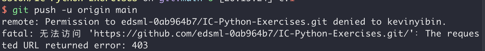

#### 解决方案

第一步，将github中的项目clone下来

第二步，修改.git/cofig中的url

```bash
cd 到项目中，编辑 .git/cofig中的url
    `vim .git/config`
将
    [remote "origin"]
   	url = https://github.com/git的用户名/项目名称
的url改为
    url = https://git的用户名@github.com/git的用户名/项目名称
```

第三步，`git push -u origin master

